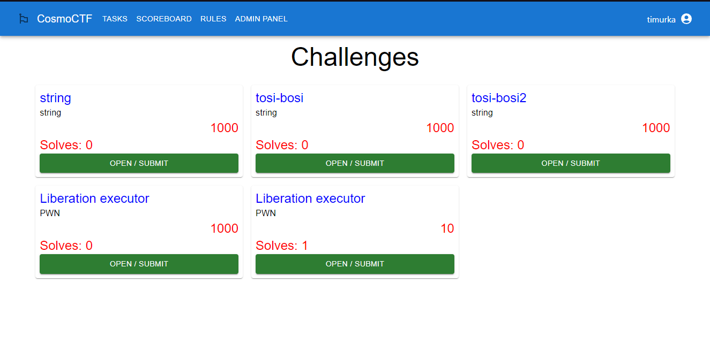

# CTF Platform
Платформа для проведения CTF-соревнований в формате Jeopardy(task-based). Деплой тасков не предоставляет!!! 
Стадия проекта - Proof-of-concept

Изначально создавался для Школы Космонавтики
<!--Блок информации о репозитории в бейджах-->

<!--Установка-->
## Установка и запуск
Для запуска требуется Docker Compose.

```
docker-compose build
docker-compose up
```
## Порты (по умолчанию):
Сервис работает на 80 порту как на основном:
* 80 - Nginx (для пользователей) - реверс-прокси
* 3000 - React JS (на этот порт не обращаться, а использовать 80) - фронт-энд
* 5432 - PostgreSQL 
* 8080 - ASP.NET Core - API приложения

## Возможности:
* Есть форма регистрации пользователей и полноценная манипуляция онными
* Для аутентификации используются JWT-токены
* Реализован режим соло соревнований - 1 пользователь = 1 участник

## Проблемы:
API:
* не используется HTTPS
* данные для подключения захаркожены
* для использования Swagger нужно обращаться на 8080 порт, а не на Nginx
* JWT-secretkey тоже захардкожен
  
Фронт-энд:
* Не протестирован адаптивный режим интерфейса
* Не реализована админ-панель, приветственная страница и страница с правилами
* При вызове уведомления через react-toastify появляются 2 тоста: цифра 2 и необходимый тост
* В текущем билде проекта, react стартует не в продакшен-моде
